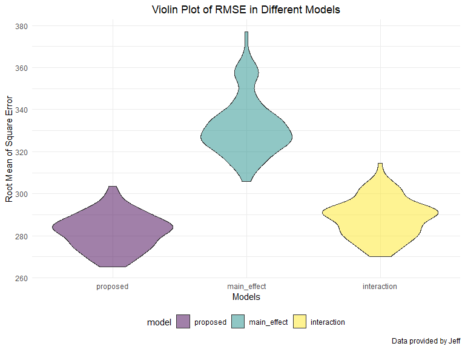

p8105\_hw6\_jt3174
================
Jingyi Tang
11/23/2019

``` r
# ensure reproductivity
set.seed(1)

# load library
library(tidyverse)
```

    ## -- Attaching packages ----------------------------------------------------------- tidyverse 1.3.0 --

    ## v ggplot2 3.2.1     v purrr   0.3.3
    ## v tibble  2.1.3     v dplyr   0.8.3
    ## v tidyr   1.0.0     v stringr 1.4.0
    ## v readr   1.3.1     v forcats 0.4.0

    ## -- Conflicts -------------------------------------------------------------- tidyverse_conflicts() --
    ## x dplyr::filter() masks stats::filter()
    ## x dplyr::lag()    masks stats::lag()

``` r
library(modelr)
library(mgcv)
```

    ## Loading required package: nlme

    ## 
    ## Attaching package: 'nlme'

    ## The following object is masked from 'package:dplyr':
    ## 
    ##     collapse

    ## This is mgcv 1.8-28. For overview type 'help("mgcv-package")'.

``` r
library(ggplot2)
library(viridis)
```

    ## Loading required package: viridisLite

``` r
library(ggridges)
```

    ## 
    ## Attaching package: 'ggridges'

    ## The following object is masked from 'package:ggplot2':
    ## 
    ##     scale_discrete_manual

``` r
knitr::opts_chunk$set(
  # display the code in the code truck above its results in the final document
  echo = TRUE,
  # do not display any warning messages generated by the code
  warning = FALSE,
  # set the figure to be 8 x 6, and the proportion it takes to be 90%
  fig.width = 8,
  fig.height = 6, 
  out.width = "90%"
)

# setting a global options for continuous data color family and a different format to set discrete data to have a color family
options(
  ggplot2.countinuous.colour = "viridis",
  ggplot2.countinuous.fill = "viridis"
)

scale_colour_discrete = scale_colour_viridis_d
scale_fill_discrete = scale_fill_viridis_d

# have a minimal theme and legends at the bottom
theme_set(theme_minimal() + theme(legend.position = "bottom"))
```

## Problem 1

``` r
# Load and clean the data for regression analysis (i.e. convert numeric to factor where appropriate, check for missing data, etc.).

baby = read_csv("./data/birthweight.csv") %>% 
  # clean names
  janitor::clean_names() %>% 
  # use case_when to give the values of certain variables new values
  mutate(
    # baby’s sex (male = 1, female = 2)
    babysex = as.factor(case_when(
      babysex == 1 ~ "male",
      babysex == 2 ~ "female"
    )),
    # father’s race (1 = White, 2 = Black, 3 = Asian, 4 = Puerto Rican, 8 = Other, 9 = Unknown)
    frace = as.factor(case_when(
      frace == 1 ~ "White",
      frace == 2 ~ "Black",
      frace == 3 ~ "Asian",
      frace == 4 ~ "Puerto Rican",
      frace == 8 ~ "Other",
      frace == 9 ~ "Unknown"
    )),
    # presence of malformations that could affect weight (0 = absent, 1 = present)
    malform = as.factor(case_when(
      malform == 0 ~ "absent",
      malform == 1 ~ "present"
    )),
    # mother’s race (1 = White, 2 = Black, 3 = Asian, 4 = Puerto Rican, 8 = Other)
    mrace = as.factor(case_when(
      mrace == 1 ~ "White",
      mrace == 2 ~ "Black",
      mrace == 3 ~ "Asian",
      mrace == 4 ~ "Puerto Rican",
      mrace == 8 ~ "Other"
    ))  
  )
```

    ## Parsed with column specification:
    ## cols(
    ##   .default = col_double()
    ## )

    ## See spec(...) for full column specifications.

``` r
# checking if there is any missing value in the fataframe called baby
# if all of the values in the table returned were 0's, there are no missing values
sapply(baby, function(x) sum(is.na(x))) %>% 
  knitr::kable(., col.names = "Number of Missing Value", caption = "Table for Variables and Their Missing Values")
```

|          | Number of Missing Value |
| -------- | ----------------------: |
| babysex  |                       0 |
| bhead    |                       0 |
| blength  |                       0 |
| bwt      |                       0 |
| delwt    |                       0 |
| fincome  |                       0 |
| frace    |                       0 |
| gaweeks  |                       0 |
| malform  |                       0 |
| menarche |                       0 |
| mheight  |                       0 |
| momage   |                       0 |
| mrace    |                       0 |
| parity   |                       0 |
| pnumlbw  |                       0 |
| pnumsga  |                       0 |
| ppbmi    |                       0 |
| ppwt     |                       0 |
| smoken   |                       0 |
| wtgain   |                       0 |

Table for Variables and Their Missing Values

There is no missing value in the dataset `baby`, and this dataset is
cleaned as stated in the homework page.

For a regression model to propose, I decided to use anova to test nested
model. I started with full regression, and then decided by the p-value
of each factor in the model to decide to keep or not for the proposed
model. And then I will use anova test these two models to decided the
final proposed model in this step.

``` r
# full regression model
full_model = lm(bwt ~ ., data = baby)

# diaplay the model summary
summary(full_model)$coefficient%>%
  knitr::kable(., col.names = c("Estimate", "Std. Error", "t value","Pr(>|t|)"), caption = "result of main effect linear regression model")
```

|                   |       Estimate |  Std. Error |     t value | Pr(\>|t|) |
| ----------------- | -------------: | ----------: | ----------: | --------: |
| (Intercept)       | \-6306.8345949 | 659.2639908 | \-9.5664782 | 0.0000000 |
| babysexmale       |   \-28.7073088 |   8.4652447 | \-3.3911966 | 0.0007021 |
| bhead             |    130.7781455 |   3.4523248 |  37.8811826 | 0.0000000 |
| blength           |     74.9535780 |   2.0216656 |  37.0751613 | 0.0000000 |
| delwt             |      4.1007326 |   0.3948202 |  10.3863301 | 0.0000000 |
| fincome           |      0.2898207 |   0.1795416 |   1.6142265 | 0.1065513 |
| fraceBlack        |    \-6.9048265 |  78.8349060 | \-0.0875859 | 0.9302099 |
| fraceOther        |   \-16.9391876 |  97.5931709 | \-0.1735694 | 0.8622120 |
| fracePuerto Rican |   \-68.2323428 |  78.4692463 | \-0.8695425 | 0.3845988 |
| fraceWhite        |   \-21.2361118 |  69.2959907 | \-0.3064551 | 0.7592729 |
| gaweeks           |     11.5493872 |   1.4653680 |   7.8815609 | 0.0000000 |
| malformpresent    |      9.7649680 |  70.6258929 |   0.1382633 | 0.8900388 |
| menarche          |    \-3.5507723 |   2.8950777 | \-1.2264860 | 0.2200827 |
| mheight           |      9.7874130 |  10.3115672 |   0.9491683 | 0.3425881 |
| momage            |      0.7593479 |   1.2221417 |   0.6213256 | 0.5344182 |
| mraceBlack        |   \-60.0487959 |  80.9532075 | \-0.7417717 | 0.4582660 |
| mracePuerto Rican |     34.9078811 |  80.9480792 |   0.4312379 | 0.6663169 |
| mraceWhite        |     91.3866079 |  71.9189677 |   1.2706885 | 0.2039079 |
| parity            |     95.5411137 |  40.4792711 |   2.3602479 | 0.0183069 |
| ppbmi             |      4.3537865 |  14.8913292 |   0.2923706 | 0.7700173 |
| ppwt              |    \-3.4715550 |   2.6121254 | \-1.3290155 | 0.1839131 |
| smoken            |    \-4.8543629 |   0.5870549 | \-8.2690107 | 0.0000000 |

result of main effect linear regression model

Here, accoding to the p-values, I am going to keep the varaibles
`babysex`, `bhead`, `blength`, `delwt`, `gaweeks`, `parity`, `smoke`.

``` r
# proposed model with 
proposed_model = lm(bwt ~ babysex + bhead + blength + delwt + gaweeks + parity + smoken, data = baby)

# diaplay the model summary
summary(proposed_model)$coefficient%>%
  knitr::kable(., col.names = c("Estimate", "Std. Error", "t value","Pr(>|t|)"), caption = "result of main effect linear regression model")
```

|             |      Estimate | Std. Error |     t value | Pr(\>|t|) |
| ----------- | ------------: | ---------: | ----------: | --------: |
| (Intercept) | \-6264.282876 | 95.8174152 | \-65.377289 | 0.0000000 |
| babysexmale |   \-29.759772 |  8.7323916 |  \-3.407975 | 0.0006604 |
| bhead       |    137.023526 |  3.5339675 |   38.773283 | 0.0000000 |
| blength     |     78.868332 |  2.0709329 |   38.083481 | 0.0000000 |
| delwt       |      2.074414 |  0.1992574 |   10.410721 | 0.0000000 |
| gaweeks     |     14.357065 |  1.5011266 |    9.564194 | 0.0000000 |
| parity      |    102.302116 | 41.7131051 |    2.452517 | 0.0142252 |
| smoken      |    \-2.168761 |  0.5819527 |  \-3.726696 | 0.0001965 |

result of main effect linear regression model

``` r
# use anova() to decide which model is better
anova(proposed_model, full_model) %>% 
  broom::tidy()
```

    ## # A tibble: 2 x 6
    ##   res.df        rss    df     sumsq statistic   p.value
    ##    <dbl>      <dbl> <dbl>     <dbl>     <dbl>     <dbl>
    ## 1   4334 344158751.    NA       NA       NA   NA       
    ## 2   4320 320724338.    14 23434413.      22.5  1.03e-56

We can see that the proposed model is a nested model for full model, and
accoding to the F-test, p-value = 1.03464e-56 \< significance level at
0.05, the proposed model is better than the full model.

``` r
# add residual and prediction to the orginal dataframe
baby_residual_prediction = baby %>% 
  add_predictions(proposed_model) %>% 
  add_residuals(proposed_model)

# create residual vs fitted plot
baby_residual_prediction %>% 
  ggplot(aes(x = pred, y = resid)) +
  geom_point(alpha = .5, color = "darksalmon") +
  labs(title = "Residuals vs. Fitted Value Plot for Proposed Model",
       x = "Fitted Values",
       y = "Residuals",
       caption = "Data provided by Jeff") +
  geom_hline(aes(yintercept = 0), color = "darkgrey") 
```


We can see that residual vs. fitted plot did not indicated that the
proposed model is a good regression model since the scatterplot is not
random.

Here, we fit two regression models stated in the homework page.

``` r
# One using length at birth and gestational age as predictors (main effects only)

main_effect_model = lm(bwt ~ blength + gaweeks, data = baby)

# diaplay the model summary
summary(main_effect_model)$coefficient%>%
  knitr::kable(., col.names = c("Estimate", "Std. Error", "t value","Pr(>|t|)"), caption = "result of main effect linear regression model")
```

|             |     Estimate | Std. Error |    t value | Pr(\>|t|) |
| ----------- | -----------: | ---------: | ---------: | --------: |
| (Intercept) | \-4347.66707 |  97.958360 | \-44.38281 |         0 |
| blength     |    128.55569 |   1.989891 |   64.60439 |         0 |
| gaweeks     |     27.04673 |   1.717930 |   15.74379 |         0 |

result of main effect linear regression model

``` r
# One using head circumference, length, sex, and all interactions (including the three-way interaction) between these

interaction_model = lm(bwt ~ bhead * blength * babysex , data = baby)

# display the model summary
summary(interaction_model)$coefficient%>%
  knitr::kable(., col.names = c("Estimate", "Std. Error", "t value","Pr(>|t|)"), caption = "result of interaction linear regression model")
```

|                           |      Estimate |   Std. Error |     t value | Pr(\>|t|) |
| ------------------------- | ------------: | -----------: | ----------: | --------: |
| (Intercept)               |  \-801.948671 | 1102.3077046 | \-0.7275180 | 0.4669480 |
| bhead                     |   \-16.597546 |   34.0916082 | \-0.4868514 | 0.6263883 |
| blength                   |   \-21.645964 |   23.3720477 | \-0.9261475 | 0.3544209 |
| babysexmale               | \-6374.868351 | 1677.7669213 | \-3.7996150 | 0.0001469 |
| bhead:blength             |      3.324444 |    0.7125586 |   4.6655020 | 0.0000032 |
| bhead:babysexmale         |    198.393181 |   51.0916850 |   3.8830816 | 0.0001047 |
| blength:babysexmale       |    123.772887 |   35.1185360 |   3.5244319 | 0.0004288 |
| bhead:blength:babysexmale |    \-3.878053 |    1.0566296 | \-3.6702106 | 0.0002453 |

result of interaction linear regression model

``` r
# Make this comparison in terms of the cross-validated prediction error; use crossv_mc and functions in purrr as appropriate.

# crossv_mc preforms the training / testing split multiple times, a stores the datasets using list columns.
cv_df = crossv_mc(baby, 100)

cv_df = cv_df %>% 
  mutate(
    train = map(train, as_tibble),
    test = map(test, as_tibble))

cv_df = cv_df %>% 
  # create models
  mutate(proposed_model  = map(train, ~lm(bwt ~ babysex + bhead + blength + delwt + gaweeks + parity + smoken, data = .x)),
         main_effect_model  = map(train, ~lm(bwt ~ blength + gaweeks, data = .x)),
         interaction_model  = map(train, ~lm(bwt ~ bhead * blength * babysex, data = .x))) %>% 
  # calculate rmse
  mutate(rmse_proposed = map2_dbl(proposed_model, test, ~rmse(model = .x, data = .y)),
         rmse_main_effect = map2_dbl(main_effect_model, test, ~rmse(model = .x, data = .y)),
         rmse_interaction = map2_dbl(interaction_model, test, ~rmse(model = .x, data = .y)))
```

I will make a violin plot to show the distribution of rmse for these
three models to find the relatively best fit for this data.

``` r
cv_df %>% 
  # select only variable started with rmse
  select(starts_with("rmse")) %>% 
  # convert into long form
  pivot_longer(
    everything(),
    names_to = "model", 
    values_to = "rmse",
    names_prefix = "rmse_") %>% 
  # relevel the factor by first appearance
  mutate(model = fct_inorder(model)) %>% 
  # plot: x-axis - model; y-axis = rmse; fill difference colors by model
  ggplot(aes(x = model, y = rmse, fill = model)) +
  # violin plot
  geom_violin(alpha = 0.5) +
  labs(title = "Violin Plot of RMSE in Different Models",
       x = "Models",
       y = "Root Mean of Square Error",
       caption = "Data provided by Jeff") +
  theme(plot.title = element_text(hjust = 0.5))
```



Based on these results, there’s clearly improvements between the main
effect model and interaction and proposed model. The proposed model is
slightly better than interaction model, although the evidence is not by
much, the advance is not obvious. Hence, here I would use the proposed
model.

## Problem 2

``` r
weather_df = 
  rnoaa::meteo_pull_monitors(
    c("USW00094728"),
    var = c("PRCP", "TMIN", "TMAX"), 
    date_min = "2017-01-01",
    date_max = "2017-12-31") %>%
  mutate(
    name = recode(id, USW00094728 = "CentralPark_NY"),
    tmin = tmin / 10,
    tmax = tmax / 10) %>%
  select(name, id, everything())
```

    ## Registered S3 method overwritten by 'crul':
    ##   method                 from
    ##   as.character.form_file httr

    ## Registered S3 method overwritten by 'hoardr':
    ##   method           from
    ##   print.cache_info httr

    ## file path:          C:\Users\Jingyi\AppData\Local\rnoaa\rnoaa\Cache/ghcnd/USW00094728.dly

    ## file last updated:  2019-10-04 20:34:21

    ## file min/max dates: 1869-01-01 / 2019-10-31

``` r
# draw bootstrap samples
boot_straps = weather_df %>% 
  modelr::bootstrap(n = 5000)

# repeat analysis pipeline using the bootstrap function 
boot_straps = boot_straps %>% 
         # models contain info of regression model of each term in strap
  mutate(models = map(strap, ~lm(tmax ~ tmin, data = .x)),
         # results contains tidied data of the regression model
         results = map(models, broom::tidy),
         variables = map(models, broom::glance)) %>% 
  # get rid of strap and models, but keep everything else
  select(-strap, -models) %>% 
  # expand the data
  unnest(results, variables)
```

``` r
r_square_CI = boot_straps %>% 
  # keep only the value that has value "tmin"
  filter(term == "tmin") %>% 
  pull(., r.squared) %>% 
  # obtain CI
  quantile(., c(.025, .975)) %>% 
  # convert to dataframe
  as.data.frame()
```

The CI of \(\hat{r}^2\) that comes from bootstrap is (0.8936977,
0.9274807).

``` r
boot_straps %>% 
  # keep only tmin-related info
  filter(term == "tmin") %>% 
  # plot: x-axis = r-squared
  ggplot(aes(x = r.squared)) +
  # density plot
  geom_density(alpha = 0.5, fill = "darksalmon") +
  # add first quartile line
  geom_vline(aes(xintercept = pull(r_square_CI, .)[1]), color = "darkgreen", linetype = "longdash") +
  # add thrid quartile line
  geom_vline(aes(xintercept = pull(r_square_CI, .)[2]), color = "darkorange", linetype = "longdash") +
  labs(
    title = "Density Plot of the Estimate of R square",
    x = "Estimate of R square",
    y = "Density",
    caption = "Data here comes from 2017 Central Park Weather Data")
```


According to density of \(\hat{r}^2\), we can see that this is close to
normal curve. We can also tell from the CI that most of data were
distributed around the center. Hence, we can say that the estimate
\(\hat{r}^2\) is roughly distributed normally.

``` r
log_estimates = boot_straps %>% 
  # keep only variables: term, estimate
  select(term, estimate) %>% 
  # convert to wide form to get beta0(aka. intercept) and beta1(tmin)
  pivot_wider(
    # get term value to be new variable names
    names_from = term,
    # get estimate value to be new values according to their term
    values_from = estimate
  ) %>% 
  # clean names
  janitor::clean_names(.) %>% 
  # expand the intercept and t$min
  unnest(intercept, tmin) %>% 
  # add a variable to indicate log(beta0*beta1)
  mutate(log_betas = log(intercept * tmin))

log_estimates_CI = log_estimates %>% 
  pull(., log_betas) %>% 
  # obtain CI
  quantile(., c(.025, .975)) %>% 
  # convert to dataframe
  as.data.frame()
```

The CI of \(log(\hat{β}_0*\hat{β}_1)\) that comes from bootstrap is
(1.9669417, 2.0585284).

``` r
log_estimates %>% 
  # x-axis: log_betas
  ggplot(aes(x = log_betas)) +
  # density plot
  geom_density(fill = "darksalmon", alpha = 0.5) +
  # add first quartile line
  geom_vline(aes(xintercept = pull(log_estimates_CI, .)[1]), color = "darkgreen", linetype = "longdash") +
  # add thrid quartile line
  geom_vline(aes(xintercept = pull(log_estimates_CI, .)[2]), color = "darkorange", linetype = "longdash") +
  labs(
    title = "Density Plot of Natural Log of the Product of Estimate Beta's",
    x = "Natural Log of Estimate Betas' Product",
    y = "Density",
    caption = "Data here comes from 2017 Central Park Weather Data")
```


According to density of \(log(\hat{β}_0*\hat{β}_1)\), we can see that
this is close to normal curve. We can also tell from the CI that most of
data were distributed around the center. Hence, we can say that the
estimate \(log(\hat{β}_0*\hat{β}_1)\) is roughly distributed normally.
This density plot is not as “normal”/“belled” as \(\hat{r}^2\)’s
distribution.
